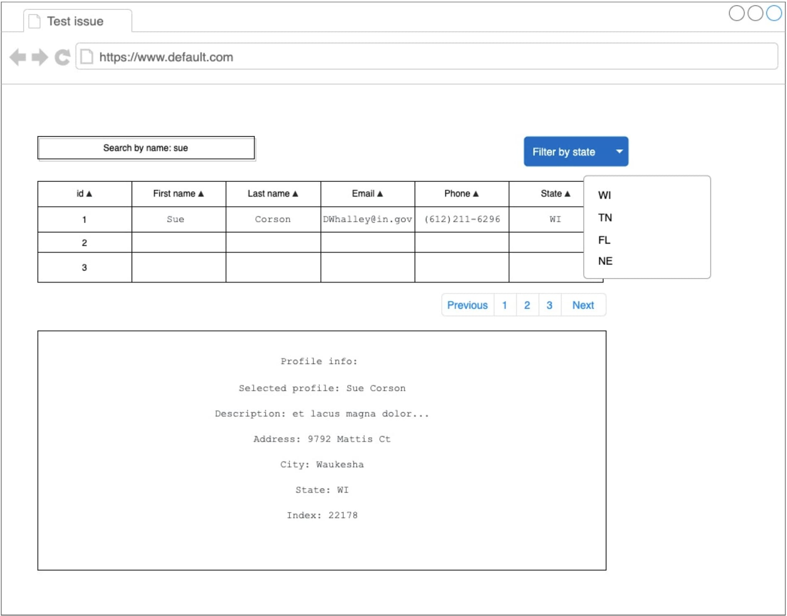

### Task:

Develop a table using data from the API:
https://itrex-react-lab-files.s3.eu-central-1.amazonaws.com/react-test-api.json.
In the table, you can click on the user's row, while additional information about the user
appears below the table.
The table and screen for the selected user is shown on the mock-up.

### Mock-up:

### Main functionality:

- The data in the table is loaded from the server when the page is first loaded.
- Filtering: a text field where the user can enter text. In this case. the rows of the
  Table inat do not contain ine entered substring are nidden.
- B clicking on a row in the table. additional intormation is disolaved in the block
  below the table.
- Sort by columns: when vou click on a column. the table is sorted in ascending
  order, when you click again, in descending order. The direction of sorting is indicated by a graphic element.
- Filter by state using Select-a.

### Additional functionality:

- Client pagination: data must be displayed page by page, 20 items per page.

### Requirements:

- Final format: index.html, styles.css, js-scripts. The structure is at your discretion.
- There is no design, any design is permissible. A beautiful design will be a plus.
- Don't use component libraries (bootstrap/material-ui/etc).
- The functionality must be implemented independently.

### It would be a plus:

- Using npm / gulp / webpack, etc.
- Github pages.
- Using frameworks or libraries such as React / Redux.
